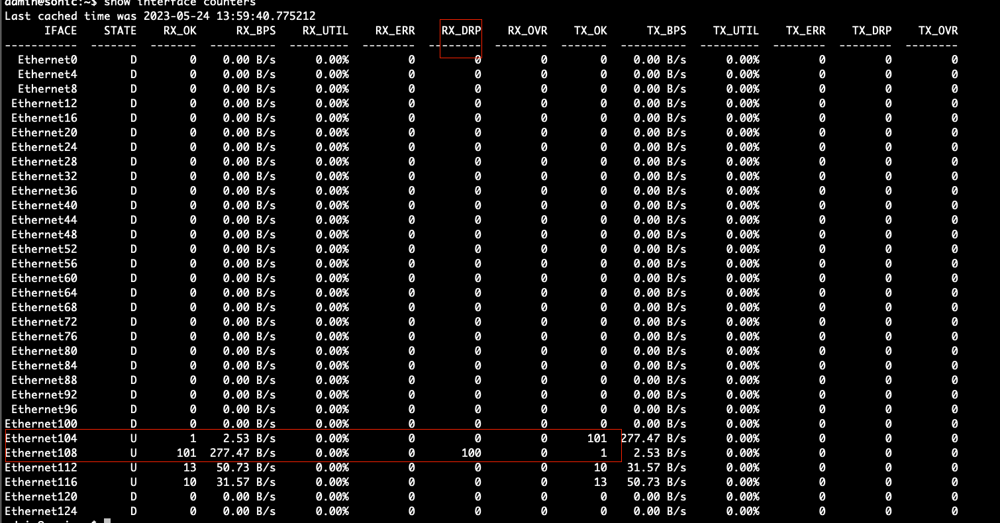

<h1>Run Tests on Sonic DUT in a Self contained Manner</h1>

- [Send Packet using scapy with back to back port connection on the  Sonic DUT](#Send-Packet-using-scapy-with-back-to-back-port-connection-on-the-Sonic-DUT)
    -[Overview](#Overview)
    - [Approach 1](#Approach-1)
    - [Approach 2](#Approach-2)
    - [Approach 3](#Approach-3)
- [Run Ixia-C as traffic generator (TODO)]()

## Sonic DUT version Info 

SONiC Software Version: SONiC.202205.263207-f2a687b33
SONiC OS Version: 11
Distribution: Debian 11.6
Kernel: 5.10.0-18-2-amd64
Build commit: f2a687b33
Build date: Sat Apr 29 13:10:51 UTC 2023
Built by: AzDevOps@vmss-soni000YTP

Platform: x86_64-accton_as7712_32x-r0
HwSKU: Accton-AS7712-32X
ASIC: broadcom
ASIC Count: 1
Serial Number: 771232X1721044
Model Number: FP3ZZ7632014A


## Send Packet using scapy with back to back port connection on the  Sonic DUT

### Overview 

A back to back connection on two of the dut interfaces has been made. Ethernet104 is connected to Ethernet108 with a 100G DAC cable.
The links are UP and IPs configured with 10.0.0.52/31 and 10.0.0.53/31 respectively on the interfaces. We are trying to send 100 IP packets on Ethernet104 using scapy and see
if we are receiving the packet on the Ethernet108 interface using tcpdump. 

Below are the the different approaches tried inorder to receive the packet on the peer port

### Approach 1

Constructed a raw packet with IP source and destination headers

```sh
sudo scapy
p=Ether()/IP(src='10.0.0.52', dst='10.0.0.53')/Raw('Hi I am raw packet!!!!!!!!!')
num_packets = 100
for _ in range(num_packets):
    sendp(p,iface='Ethernet104')
```
```sh
sudo tcpdump -i Ethernet108 -en -A | grep raw
```

- Result:
    - Packets are trasmitted via the Ethernet104 interface which can be verified from the tcpdump output 
    - No packets received on Ethernet108 interface

### Approach 2

Constructed a raw packet with IP source and destination headers and source and destination mac of the interfaces
```sh
sudo scapy
p=Ether(src='a8:2b:b5:37:eb:1c', dst='a8:2b:b5:37:eb:1c')/IP(src='10.0.0.52', dst='10.0.0.53')/Raw('Hi I am raw packet!!!!!!!!!')
num_packets = 100
for _ in range(num_packets):
    sendp(p,iface='Ethernet104')
```
```sh
sudo tcpdump -i Ethernet108 -en -A | grep raw
```

- Result:
    - Packets are trasmitted via the Ethernet104 interface which can be verified from the tcpdump output 
    - No packets received on Ethernet108 interface

### Approach 3

constructed a raw packet with IP source and destination headers and source and destination mac of the interfaces and deleted the IP checksum on the packet

```sh
sudo scapy
p=Ether(src='a8:2b:b5:37:eb:1c', dst='a8:2b:b5:37:eb:1c')/IP(src='10.0.0.52', dst='10.0.0.53')/Raw('Hi I am raw packet!!!!!!!!!')
del p.getlayer(IP).chksum
num_packets = 100
for _ in range(num_packets):
    sendp(p,iface='Ethernet104')
```
```sh
sudo tcpdump -i Ethernet108 -en -A | grep raw
```

- Result:
    - Packets are trasmitted via the Ethernet104 interface which can be verified from the tcpdump output 
    - No packets received on Ethernet108 interface

### Note

Did a #show interface counters on the dut, we were able to see that the Ethernet108 is actually receiving the packet but for some reason its dropping the packet, but its dropping the received packets for some reason


### Question ?

- Can you please let us know what else should be done in order for Ethernet108 interface to start receive packets?

## Run Ixia-C as traffic generator (TODO)

TODO